# TopInfrared Architecture Documentation

This document provides a comprehensive overview of TopInfrared's technical architecture, design patterns, and system components.

## 🏛️ High-Level Architecture

TopInfrared follows a modular Android architecture based on Clean Architecture principles with clear separation between presentation, domain, and data layers.

### Clean Architecture Overview

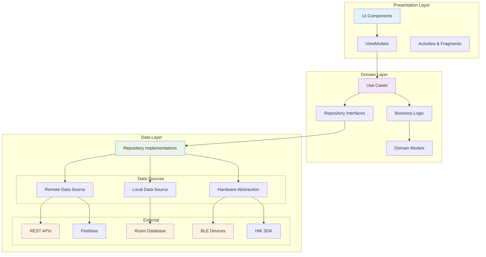

### Data Flow Architecture

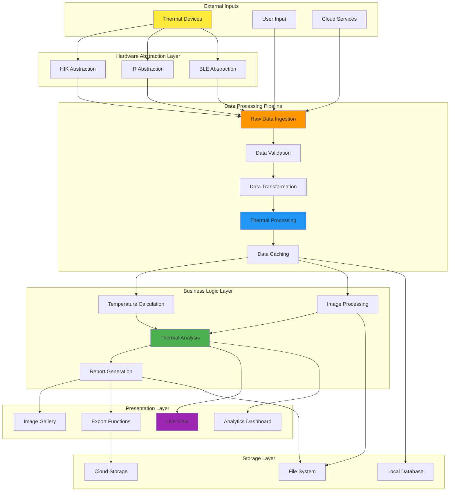

## 📦 Module Architecture

### Core Application Module (`app/`)

The main application module serves as the entry point and orchestrates all feature modules.

#### Responsibilities:
- Application lifecycle management
- Dependency injection setup (Dagger/Hilt)
- Navigation coordination between modules
- Global configuration and theming
- Build variant management

#### Key Components:
```kotlin
// Application class with dependency injection
class TopInfraredApplication : Application(), HasAndroidInjector {
    @Inject lateinit var androidInjector: DispatchingAndroidInjector<Any>
    
    override fun onCreate() {
        super.onCreate()
        DaggerApplicationComponent.create().inject(this)
    }
}

// Main activity with navigation host
class MainActivity : AppCompatActivity() {
    private lateinit var navController: NavController
    // Handle navigation between feature modules
}
```

### Feature Modules

#### Thermal Processing Modules

##### `component/thermal-ir/` - Core Thermal Processing
```kotlin
// Core thermal data processing
interface ThermalProcessor {
    fun processRawData(data: ByteArray): ThermalImage
    fun applyCalibration(image: ThermalImage): ThermalImage
    fun convertToTemperature(rawValue: Int): Float
}

// Temperature measurement tools
class TemperatureMeasurement {
    fun measurePoint(x: Int, y: Int): Temperature
    fun measureArea(polygon: List<Point>): TemperatureStats
    fun measureLine(start: Point, end: Point): List<Temperature>
}
```

##### `component/thermal-hik/` - HIK Device Integration
Specialized module for HIK thermal camera communication:
- Custom communication protocols
- Device-specific calibration algorithms
- Hardware abstraction layer

##### `component/pseudo/` - Color Processing
```kotlin
// Thermal-to-visible color mapping
class PseudoColorProcessor {
    fun applyColorPalette(thermalImage: ThermalImage, palette: ColorPalette): Bitmap
    fun createCustomPalette(colors: List<Color>): ColorPalette
}

enum class ColorPalette {
    IRON, RAINBOW, GRAYSCALE, HOT, COOL, MEDICAL
}
```

##### `component/edit3d/` - 3D Visualization
Advanced 3D thermal visualization using OpenGL ES:
```kotlin
class Thermal3DRenderer : GLSurfaceView.Renderer {
    fun renderThermalMesh(thermalData: Array<Array<Float>>)
    fun applyLighting(lightPosition: Vector3)
    fun handleUserInteraction(gesture: MotionEvent)
}
```

#### Connectivity Modules

##### `BleModule/` - Bluetooth Low Energy
Handles all Bluetooth device communication:

```kotlin
// BLE device management
interface BleDeviceManager {
    fun scanForDevices(): Observable<BleDevice>
    fun connectToDevice(device: BleDevice): Single<Connection>
    fun writeCharacteristic(char: UUID, data: ByteArray): Completable
    fun readCharacteristic(char: UUID): Single<ByteArray>
}

// Connection state management
sealed class ConnectionState {
    object Disconnected : ConnectionState()
    object Connecting : ConnectionState()
    object Connected : ConnectionState()
    object Error : ConnectionState()
}
```

##### Hardware Abstraction Layer
```kotlin
// Generic thermal device interface
interface ThermalDevice {
    val deviceInfo: DeviceInfo
    val capabilities: List<DeviceCapability>
    
    suspend fun initialize(): Result<Unit>
    suspend fun startStreaming(): Flow<ThermalFrame>
    suspend fun stopStreaming()
    suspend fun captureImage(): ThermalImage
}

// Specific device implementations
class HikThermalDevice : ThermalDevice { /* ... */ }
class GenericBtThermalDevice : ThermalDevice { /* ... */ }
```

### Library Modules

#### `libcom/` - Common Utilities

##### PDF Generation
```kotlin
object PDFGenerator {
    fun generateThermalReport(
        thermalImages: List<ThermalImage>,
        measurements: List<Measurement>,
        template: ReportTemplate
    ): File {
        // Generate professional thermal analysis reports
    }
}
```

##### File Management
```kotlin
class FileManager {
    fun saveThermalImage(image: ThermalImage): File
    fun exportMeasurementData(data: List<Measurement>): File
    fun createBackup(): File
}
```

#### `libui/` - UI Components

Custom UI components optimized for thermal imaging:

```kotlin
// Thermal image display with measurement overlay
class ThermalImageView : ImageView {
    fun setThermalImage(image: ThermalImage)
    fun addMeasurementOverlay(measurement: Measurement)
    fun setColorPalette(palette: ColorPalette)
}

// Temperature scale bar
class TemperatureScaleView : View {
    fun setTemperatureRange(min: Float, max: Float)
    fun setUnit(unit: TemperatureUnit)
}
```

#### `libir/` - Infrared Processing Core

Core infrared and thermal processing algorithms:

```kotlin
// Low-level thermal processing
object ThermalAlgorithms {
    fun calibrateRawData(raw: IntArray, calibration: CalibrationData): FloatArray
    fun applyNonUniformityCorrection(data: FloatArray): FloatArray
    fun temperatureToRaw(temp: Float, calibration: CalibrationData): Int
}

// Image enhancement
object ImageEnhancement {
    fun sharpen(image: ThermalImage): ThermalImage
    fun denoise(image: ThermalImage): ThermalImage
    fun enhanceContrast(image: ThermalImage): ThermalImage
}
```

## 🔄 Data Flow Architecture

### Thermal Image Processing Pipeline

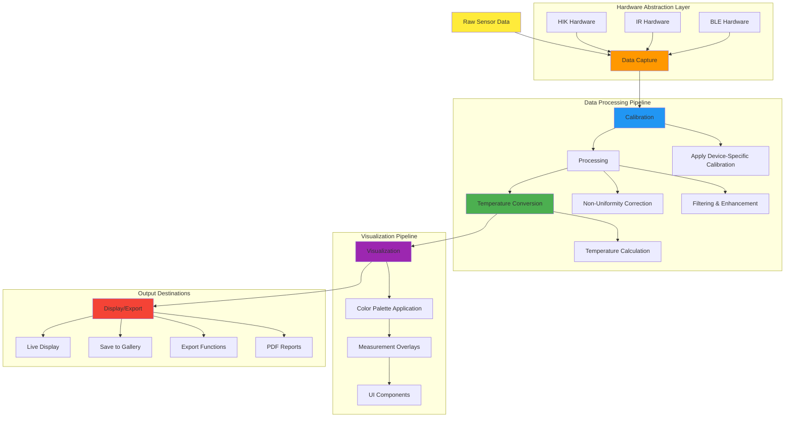

### Component Interaction Diagram

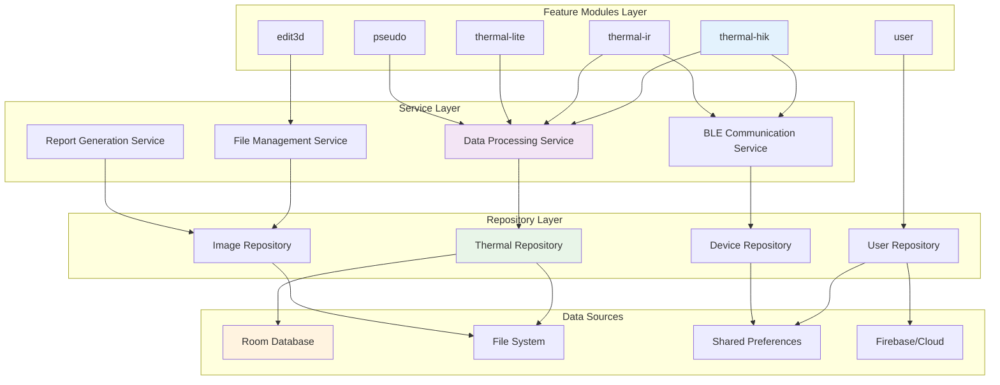

### Reactive Programming with RxJava

```kotlin
class ThermalDataProcessor {
    fun processThermalStream(): Observable<ThermalImage> {
        return thermalDevice.getDataStream()
            .map { rawData -> applyCalibration(rawData) }
            .map { calibratedData -> processImage(calibratedData) }
            .map { processedData -> convertToImage(processedData) }
            .observeOn(AndroidSchedulers.mainThread())
            .subscribeOn(Schedulers.computation())
    }
}
```

## 🗄️ Data Persistence

### Room Database Architecture

```kotlin
// Core entities
@Entity(tableName = "thermal_images")
data class ThermalImageEntity(
    @PrimaryKey val id: String,
    val timestamp: Long,
    val deviceId: String,
    val filePath: String,
    val temperature: ThermalData
)

@Entity(tableName = "measurements")
data class MeasurementEntity(
    @PrimaryKey val id: String,
    val imageId: String,
    val type: MeasurementType,
    val coordinates: String,
    val temperature: Float,
    val timestamp: Long
)

// Data Access Objects
@Dao
interface ThermalImageDao {
    @Query("SELECT * FROM thermal_images ORDER BY timestamp DESC")
    fun getAllImages(): Flow<List<ThermalImageEntity>>
    
    @Insert(onConflict = OnConflictStrategy.REPLACE)
    suspend fun insertImage(image: ThermalImageEntity)
    
    @Query("DELETE FROM thermal_images WHERE timestamp < :cutoff")
    suspend fun deleteOldImages(cutoff: Long)
}
```

## 🗄️ Data Persistence Architecture

### Database Schema Visualization

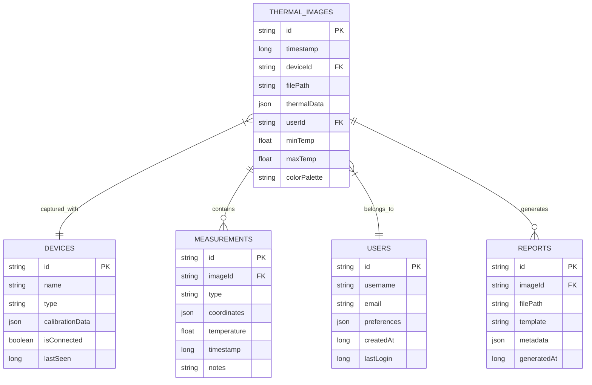

### File System Architecture

```mermaid
graph TD
    ROOT[/Android/data/com.topdon.tc001/files/]
    
    subgraph "User Data"
        ROOT --> THERMAL[ThermalImages/]
        THERMAL --> USER_DIR[{userid}/]
        USER_DIR --> GALLERY[Gallery/]
        USER_DIR --> DATALOG[DataLog/]
        USER_DIR --> PDF[Pdf/]
    end
    
    subgraph "System Data"
        ROOT --> CACHE[Cache/]
        ROOT --> BACKUP[Backup/]
        ROOT --> CONFIG[Config/]
    end
    
    subgraph "File Types"
        GALLERY --> IMG_RAW[.thermal files]
        GALLERY --> IMG_JPEG[.jpg preview]
        DATALOG --> CSV[.csv data]
        DATALOG --> JSON[.json metadata]
        PDF --> REPORTS[.pdf reports]
        CACHE --> TEMP[Temporary processing]
        BACKUP --> SYNC[Sync data]
        CONFIG --> SETTINGS[App settings]
    end
    
    subgraph "Access Patterns"
        IMG_RAW --> READ_FAST[Fast Read Access]
        CSV --> APPEND[Append-Only Logs]
        REPORTS --> SHARE[Shareable Format]
        TEMP --> AUTO_CLEANUP[Auto Cleanup]
    end
    
    style ROOT fill:#e3f2fd
    style USER_DIR fill:#f3e5f5
    style CACHE fill:#fff3e0
    style REPORTS fill:#e8f5e8
```

### Data Flow in Storage Layer

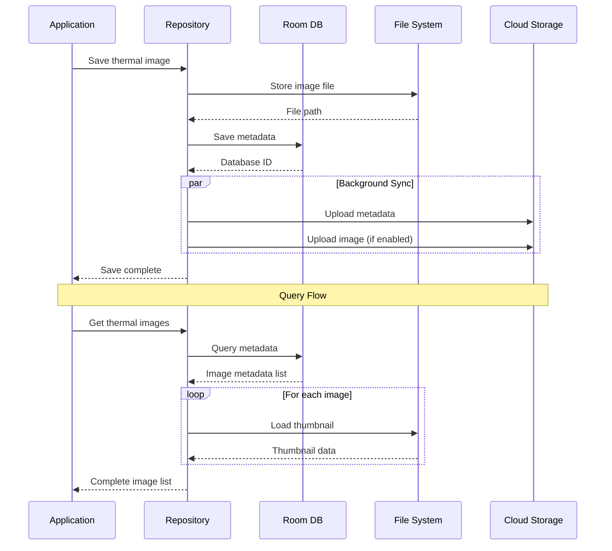

## 🔧 Build System Architecture

### Multi-Flavor Build Configuration

```gradle
// Product flavors for different markets
productFlavors {
    dev {
        buildConfigField("String", "API_BASE_URL", "\"https://dev-api.topdon.com\"")
        buildConfigField("boolean", "DEBUG_MODE", "true")
    }
    
    prod {
        buildConfigField("String", "API_BASE_URL", "\"https://api.topdon.com\"")
        buildConfigField("boolean", "DEBUG_MODE", "false")
    }
    
    insideChina {
        buildConfigField("String", "API_BASE_URL", "\"https://cn-api.topdon.com\"")
        // China-specific configurations
    }
}

// Feature-specific build configurations
dependencies {
    // Flavor-specific dependencies
    prodImplementation 'com.google.firebase:firebase-analytics'
    insideChinaImplementation 'com.umeng.umsdk:analytics'
    
    // Debug tools only in development
    debugImplementation 'com.squareup.leakcanary:leakcanary-android'
}
```

### Native Module Integration (NDK)

```cmake
# CMakeLists.txt for native thermal processing
cmake_minimum_required(VERSION 3.10.2)
project("thermal-native")

# OpenCV integration
find_package(OpenCV REQUIRED)

# Thermal processing library
add_library(thermal-native SHARED
    thermal_processor.cpp
    calibration.cpp
    image_enhancement.cpp
)

target_link_libraries(thermal-native
    ${OpenCV_LIBS}
    android
    log
)
```

## 🔐 Security Architecture

### Security Layers Overview

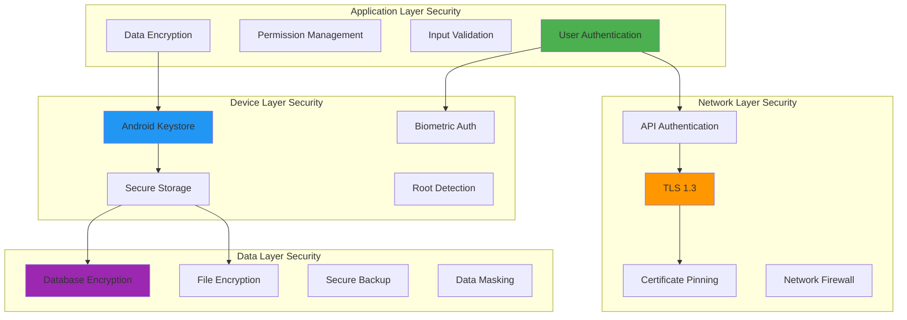

### Authentication Flow

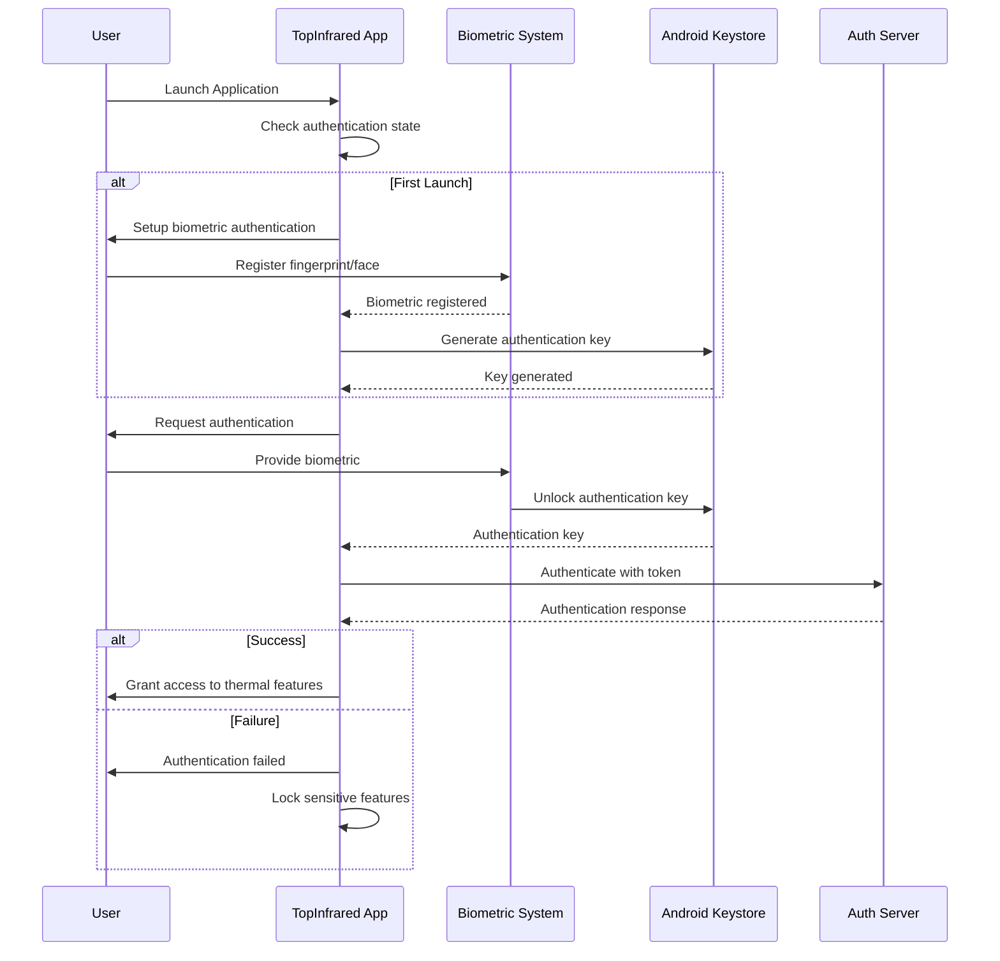

### Data Encryption Architecture

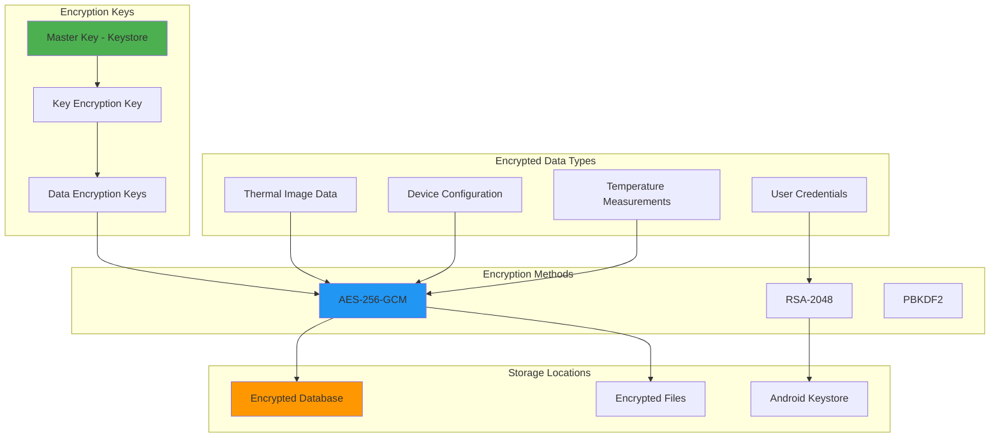

### Network Security Implementation

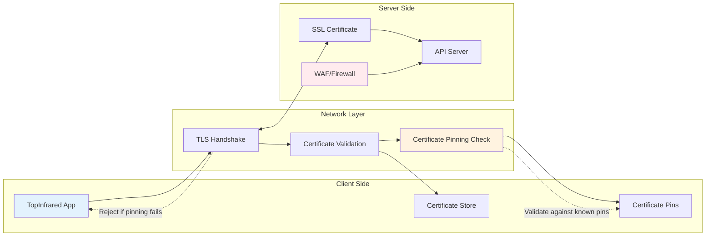

## 📊 Performance Optimization

### Memory Management

```kotlin
// Efficient bitmap handling for thermal images
class ThermalBitmapManager {
    private val bitmapCache = LruCache<String, Bitmap>(
        (Runtime.getRuntime().maxMemory() / 8).toInt()
    )
    
    fun loadThermalImage(path: String): Bitmap? {
        // Implement efficient bitmap loading with caching
        // Use BitmapFactory.Options for memory optimization
    }
}

// Background processing optimization
class ThermalProcessingScheduler {
    fun scheduleProcessing(task: ProcessingTask) {
        when (task.priority) {
            Priority.HIGH -> Schedulers.immediate().schedule(task)
            Priority.LOW -> Schedulers.computation().schedule(task)
        }
    }
}
```

### Thermal Data Compression

```kotlin
// Lossless compression for thermal data
object ThermalDataCompression {
    fun compress(thermalData: FloatArray): ByteArray {
        // Custom compression algorithm optimized for thermal data
        // Maintain temperature accuracy while reducing file size
    }
    
    fun decompress(compressedData: ByteArray): FloatArray {
        // Decompress thermal data for processing
    }
}
```

## 🧪 Testing Architecture

### Unit Testing Strategy

```kotlin
// Repository testing with mocks
@RunWith(MockitoJUnitRunner::class)
class ThermalRepositoryTest {
    @Mock private lateinit var thermalDao: ThermalDao
    @Mock private lateinit var deviceManager: ThermalDeviceManager
    
    @InjectMocks private lateinit var repository: ThermalRepository
    
    @Test
    fun `should save thermal image successfully`() {
        // Test thermal data persistence
    }
}

// Hardware abstraction layer testing
class MockThermalDevice : ThermalDevice {
    override suspend fun captureImage(): ThermalImage {
        // Return mock thermal data for testing
    }
}
```

### Integration Testing

```kotlin
// End-to-end thermal processing pipeline testing
@RunWith(AndroidJUnit4::class)
class ThermalProcessingIntegrationTest {
    @Test
    fun `should process thermal data from device to display`() {
        // Test complete thermal imaging workflow
    }
}
```

## 🚀 Deployment Architecture

### Continuous Integration

```yaml
# GitHub Actions workflow
name: Build and Test
on: [push, pull_request]

jobs:
  test:
    runs-on: ubuntu-latest
    steps:
      - uses: actions/checkout@v3
      - uses: actions/setup-java@v3
        with:
          java-version: '11'
      - name: Run unit tests
        run: ./gradlew test
      - name: Build APK
        run: ./gradlew assembleProdRelease
```

## 🔄 Complete System Architecture Overview

### Comprehensive System Diagram

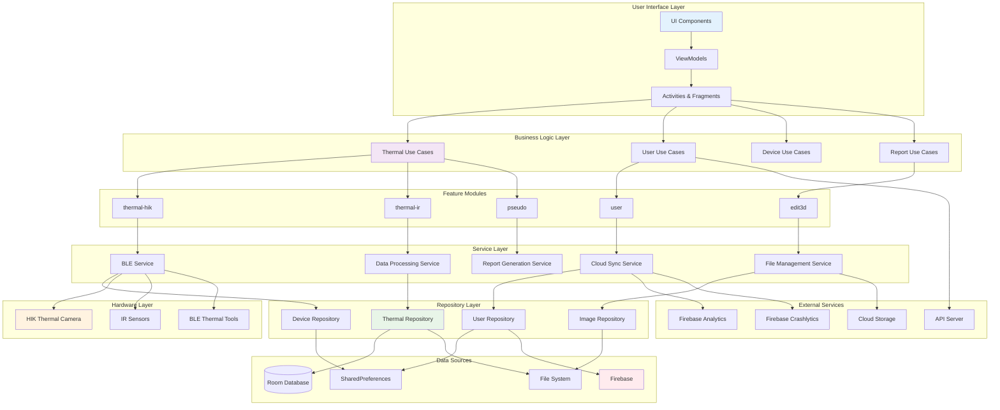

### Technology Stack Visualization

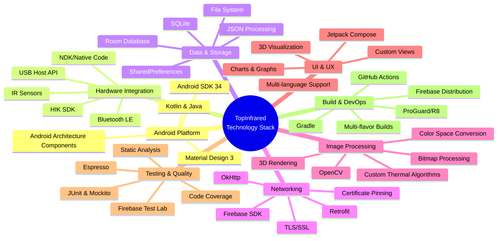

This comprehensive architecture documentation provides detailed insights into TopInfrared's modular design, data flow patterns, security implementations, and technology stack. The visual diagrams help developers understand the complex interactions between different system components and facilitate easier maintenance and future development.

### Release Pipeline

```bash
# Automated release process
./gradlew assembleProdRelease        # Build release APK
./gradlew bundleProdRelease          # Build AAB for Play Store
./gradlew publishProdReleaseApk      # Publish to distribution channels
```

This architecture ensures:
- **Scalability**: Modular design supports easy feature additions
- **Maintainability**: Clear separation of concerns and testable components
- **Performance**: Optimized for thermal data processing and visualization
- **Security**: Secure handling of thermal measurement data
- **Reliability**: Robust error handling and state management

---

For more detailed implementation examples, check the source code in the respective modules.