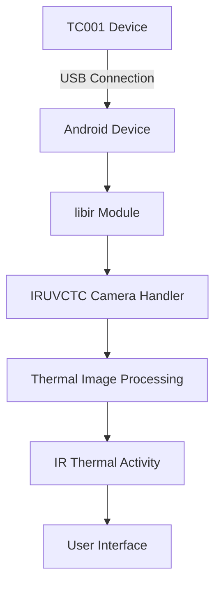
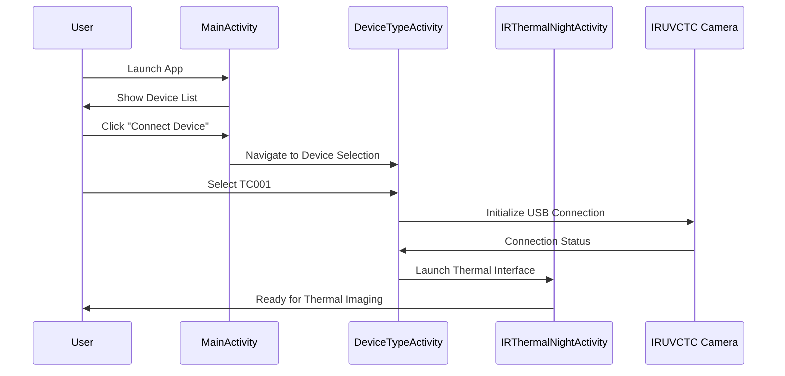
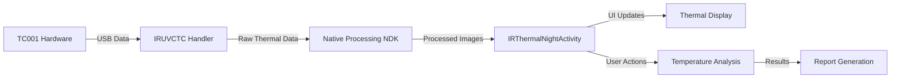
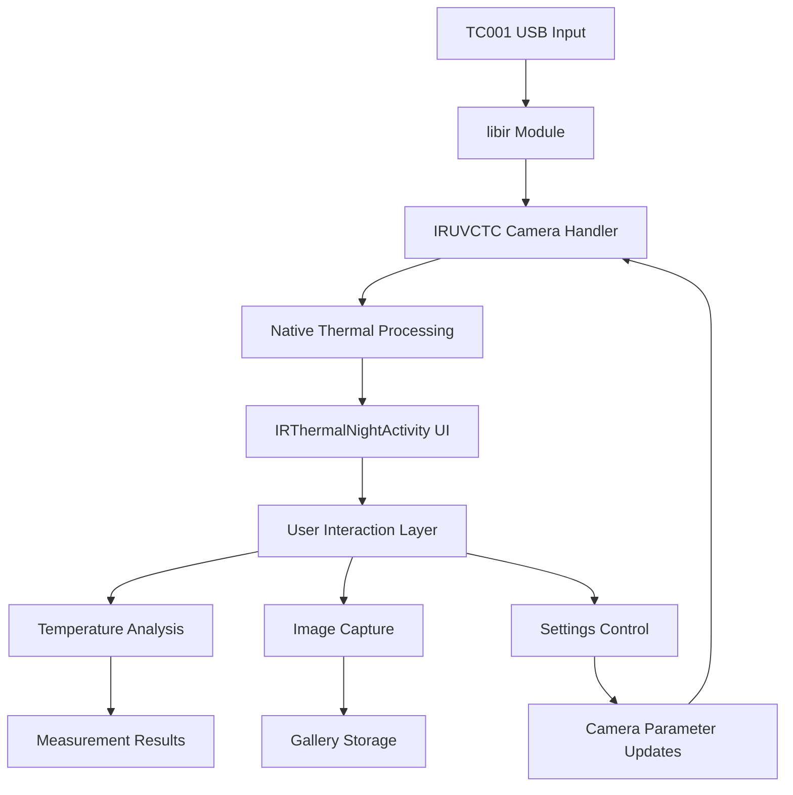

# TopInfrared TC001 - Basic IR Camera Integration Guide 🌡️📱

> Focused documentation for TC001 basic thermal imaging camera integration and UI navigation

**TC001** is the basic thermal imaging camera device supported by the TopInfrared application. This guide covers the TC001-specific integration, UI navigation, and how the system works together to provide thermal imaging capabilities.

## 📱 TC001 Overview

**TC001** is a **line-connected** (wired/USB) basic infrared thermal imaging camera that provides:

- **Real-time thermal imaging** through USB connection
- **Temperature measurement** with point, line, and area analysis
- **Live thermal visualization** with customizable color palettes
- **Image capture and analysis** capabilities
- **Professional thermal reporting** features

### Device Specifications
- **Connection Type**: USB/Wired (Line connection)
- **Communication**: Direct USB communication via UVC (USB Video Class)
- **Resolution**: Standard thermal resolution for basic analysis
- **Power**: USB-powered (no external power required)

## 🔗 TC001 Integration Architecture

### Hardware Integration


### Core Integration Components

#### 1. **libir Module** (`/libir/`)
- **Primary TC001 integration layer**
- Contains `IRUVCTC.java` - main camera handler for TC001
- Handles USB communication and device control
- Manages thermal data processing and image generation

#### 2. **Device Detection & Connection**
```kotlin
// Device type definition
enum class IRDeviceType {
    TC001 {
        override fun isLine(): Boolean = true  // USB/Line device
        override fun getDeviceName(): String = "TC001"
    }
}

// Connection checking
DeviceTools.isConnect() // Checks if TC001 is connected
```

#### 3. **Main Activity Classes**
- **`IRThermalNightActivity`**: Primary thermal imaging interface for TC001
- **`IRUVCTC.java`**: Low-level camera control and communication
- **Native processing**: NDK integration for real-time thermal processing

## 🖱️ TC001 UI Navigation Guide

### Main Application Flow

#### 1. **App Launch & Device Selection**
```mermaid
flowchart TD
    A[App Launch] --> B[MainActivity]
    B --> C[Bottom Tab Navigation]
    C --> D[MainFragment - Device List]
    D --> E{TC001 Connected?}
    E -->|Yes| F[Click TC001 Device]
    E -->|No| G[Click "Connect Device"]
    G --> H[DeviceTypeActivity]
    H --> I[Select TC001]
    I --> J[USB Connection Dialog]
    J --> K[Connect to TC001]
    F --> L[IRThermalNightActivity]
    K --> L
```

#### 2. **Bottom Tab Navigation Structure**
The main interface has **3 primary tabs**:

| Tab | Icon | Function | Purpose |
|-----|------|----------|---------|
| **Gallery** | 📁 | Local Album | View saved thermal images and reports |
| **Main** | 🏠 | Device Hub | Connect and manage TC001 device |
| **Mine** | 👤 | User Profile | Settings, help, and user management |

#### 3. **TC001 Connection Workflow**


### TC001-Specific UI Elements

#### **Main Device Interface** (`MainFragment`)
- **Device List**: Shows TC001 connection status (Online/Offline)
- **Connection Indicator**: Visual status with green (connected) or gray (disconnected)
- **Device Info**: Displays "TC001" name and connection type (Line)
- **Quick Connect**: Tap device card to enter thermal mode
- **Long Press**: Access device management options

#### **Thermal Imaging Interface** (`IRThermalNightActivity`)
- **Live Thermal Feed**: Real-time thermal imaging from TC001
- **Temperature Tools**: Point, line, area, and polygon measurement tools
- **Color Palette Selector**: Multiple thermal color schemes
- **Capture Button**: Save thermal images
- **Settings Panel**: Adjust thermal parameters and filters
- **Analysis Tools**: Temperature range adjustment and measurement display

## ⚙️ TC001 Technical Integration

### Connection Management
```kotlin
// Check TC001 connection status
val isConnected = DeviceTools.isConnect()

// TC001 device type configuration
IRDeviceType.TC001.isLine() // returns true - USB/Line device

// Navigate to thermal interface
ARouter.getInstance()
    .build(RouterConfig.IR_MAIN)
    .withBoolean(ExtraKeyConfig.IS_TC007, false) // Specify not TC007
    .navigation(context)
```

### Camera Integration Pipeline


### Core Integration Classes

#### **IRUVCTC.java** - Main Camera Handler
- **USB Communication**: Direct communication with TC001 hardware
- **Frame Processing**: Handles incoming thermal frame data
- **Device Control**: Manages camera settings and parameters
- **Data Stream**: Continuous thermal data streaming to UI layer

#### **IRThermalNightActivity** - Primary UI Controller
- **Camera Lifecycle**: Manages TC001 connection lifecycle
- **UI Coordination**: Coordinates between camera data and user interface
- **Feature Integration**: Temperature measurement, color mapping, image capture
- **Event Handling**: User interactions and device state changes

#### **DeviceTools** - Connection Utilities
```kotlin
object DeviceTools {
    fun isConnect(): Boolean // Check TC001 connection
    fun requestConnect() // Initiate connection
    fun disconnect() // Safely disconnect device
}
```

### Data Flow Architecture


## 🚀 Quick Start with TC001

### 1. **Connect TC001 Device**
- Ensure TC001 is connected via USB
- Launch TopInfrared app
- Navigate to Main tab
- Tap "Connect Device" if not shown
- Select "TC001" from device list

### 2. **Start Thermal Imaging**
- Device automatically detected when connected
- Tap TC001 device card in main interface
- App launches thermal imaging mode (`IRThermalNightActivity`)
- Live thermal feed begins automatically

### 3. **Basic Operations**
- **Temperature Measurement**: Tap screen to place measurement points
- **Color Palette**: Use palette selector to change thermal colors
- **Capture**: Tap capture button to save thermal images
- **Settings**: Access camera settings through settings panel

### 4. **Navigation**
- **Back to Main**: Use back button to return to device list
- **Gallery Access**: Bottom tab navigation to view saved images
- **Device Management**: Long-press device in main list for options

## 📋 System Requirements for TC001

### Android Device Requirements
- **Android Version**: API 24 (Android 7.0) or higher
- **USB Host Support**: Required for TC001 communication
- **RAM**: 4GB minimum for smooth thermal processing
- **Storage**: 2GB free space for thermal data

### TC001 Hardware Requirements  
- **USB Connection**: Direct USB connection to Android device
- **Power**: USB-powered (no external power required)
- **Compatibility**: Standard UVC (USB Video Class) support
- **Cable**: USB-A to USB-C or appropriate connector for your Android device

## 🛠️ Development Setup for TC001

### Prerequisites
- **Android Studio**: Arctic Fox (2020.3.1) or higher
- **Java**: JDK 17 or higher
- **Android SDK**: API 24-34 (Android 7.0-14)
- **TC001 Device**: Connected via USB for testing

### Key Project Modules for TC001
```
TopInfrared/
├── app/                          # Main application
│   └── src/main/java/com/topdon/tc001/
│       ├── MainActivity.kt       # Main app entry point
│       ├── DeviceTypeActivity.kt # Device selection
│       └── fragment/MainFragment.kt # Device management UI
├── libir/                        # TC001 core integration
│   └── src/main/java/com/infisense/usbir/
│       └── camera/IRUVCTC.java   # TC001 camera handler
└── component/thermal-ir/         # Thermal UI components
    └── activity/IRThermalNightActivity.kt # Main thermal interface
```

### Build & Test
```bash
# Clone repository
git clone [repository-url]
cd TopInfrared

# Build project
./gradlew assembleDebug

# Install on device with TC001 connected
./gradlew installDebug

# Run and test TC001 functionality
```

---

*This documentation focuses specifically on TC001 basic IR camera integration. For other thermal devices or advanced features, refer to the complete documentation suite.*