# TopInfrared TC001 - Basic IR Camera Integration Guide 🌡️📱

> Focused documentation for TC001 basic thermal imaging camera integration and UI navigation

**TC001** is the basic thermal imaging camera device supported by the TopInfrared application. This guide covers the TC001-specific integration, UI navigation, and how the system works together to provide thermal imaging capabilities.

## 📱 TC001 Overview

**TC001** is a **line-connected** (wired/USB) basic infrared thermal imaging camera that provides:

- **Real-time thermal imaging** through USB connection
- **Temperature measurement** with point, line, and area analysis
- **Live thermal visualization** with customizable color palettes
- **Image capture and analysis** capabilities
- **Professional thermal reporting** features

### Device Specifications
- **Connection Type**: USB/Wired (Line connection)
- **Communication**: Direct USB communication via UVC (USB Video Class)
- **Resolution**: Standard thermal resolution for basic analysis
- **Power**: USB-powered (no external power required)

## 🔗 TC001 Integration Architecture

### Hardware Integration
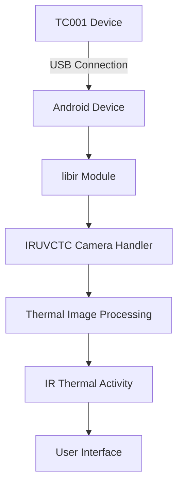

### Core Integration Components

#### 1. **libir Module** (`/libir/`)
- **Primary TC001 integration layer**
- Contains `IRUVCTC.java` - main camera handler for TC001
- Handles USB communication and device control
- Manages thermal data processing and image generation

#### 2. **Device Detection & Connection**
```kotlin
// Device type definition
enum class IRDeviceType {
    TC001 {
        override fun isLine(): Boolean = true  // USB/Line device
        override fun getDeviceName(): String = "TC001"
    }
}

// Connection checking
DeviceTools.isConnect() // Checks if TC001 is connected
```

#### 3. **Main Activity Classes**
- **`IRThermalNightActivity`**: Primary thermal imaging interface for TC001
- **`IRUVCTC.java`**: Low-level camera control and communication
- **Native processing**: NDK integration for real-time thermal processing

## 🏗️ Project Architecture

TopInfrared follows a modular Android architecture with clear separation of concerns:

### System Architecture Overview

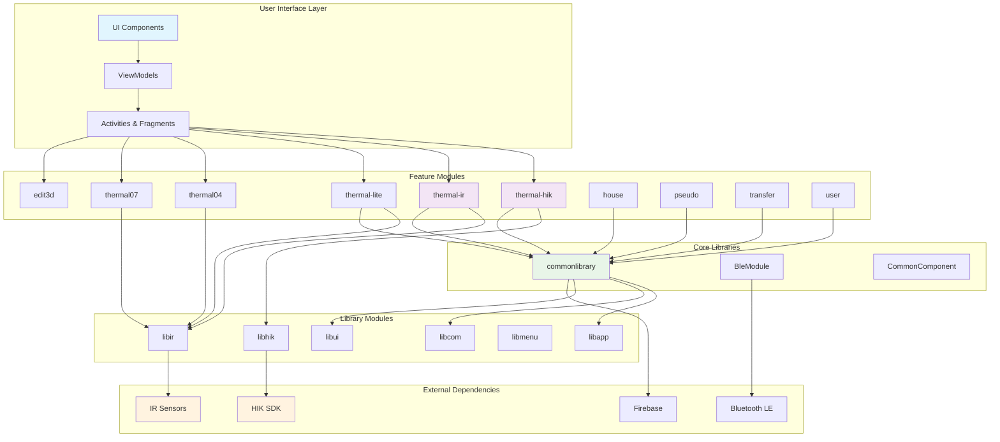

### Module Dependency Graph

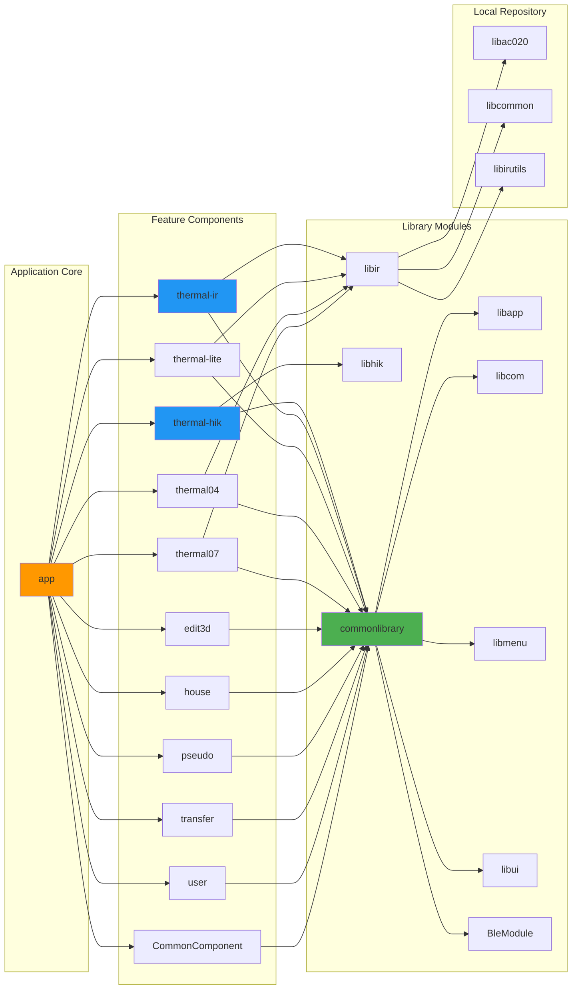

### Directory Structure
```
TopInfrared/
├── app/                          # Main application module
├── component/                    # Feature modules
│   ├── edit3d/                  # 3D thermal visualization
│   ├── pseudo/                  # Pseudo-color processing
│   ├── thermal-hik/             # HIK device integration
│   ├── thermal-ir/              # IR sensor management
│   ├── thermal-lite/            # Lightweight thermal processing
│   ├── thermal04/               # Thermal sensor model 04
│   ├── thermal07/               # Thermal sensor model 07
│   ├── transfer/                # Data transfer utilities
│   └── user/                    # User management
├── BleModule/                   # Bluetooth Low Energy module
├── libcom/                      # Common utilities and PDF generation
├── libir/                       # Core infrared processing library
├── libui/                       # UI components and charting
├── libhik/                      # HIK device specific libraries
├── libmatrix/                   # Matrix operations for image processing
├── libmenu/                     # Menu and navigation components
└── LocalRepo/                   # Local dependencies and utilities
```

### Application Flow Diagram

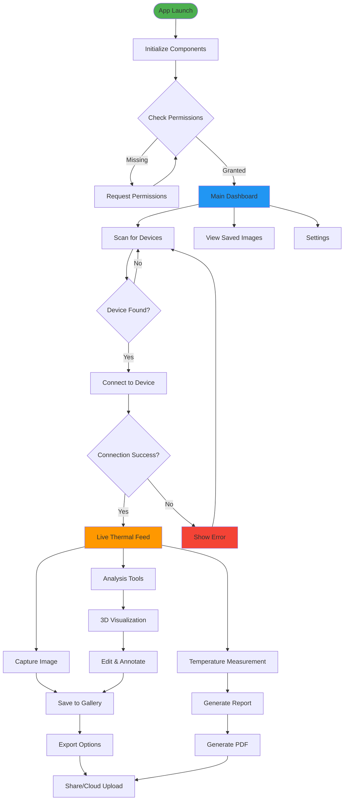

### Thermal Data Processing Pipeline

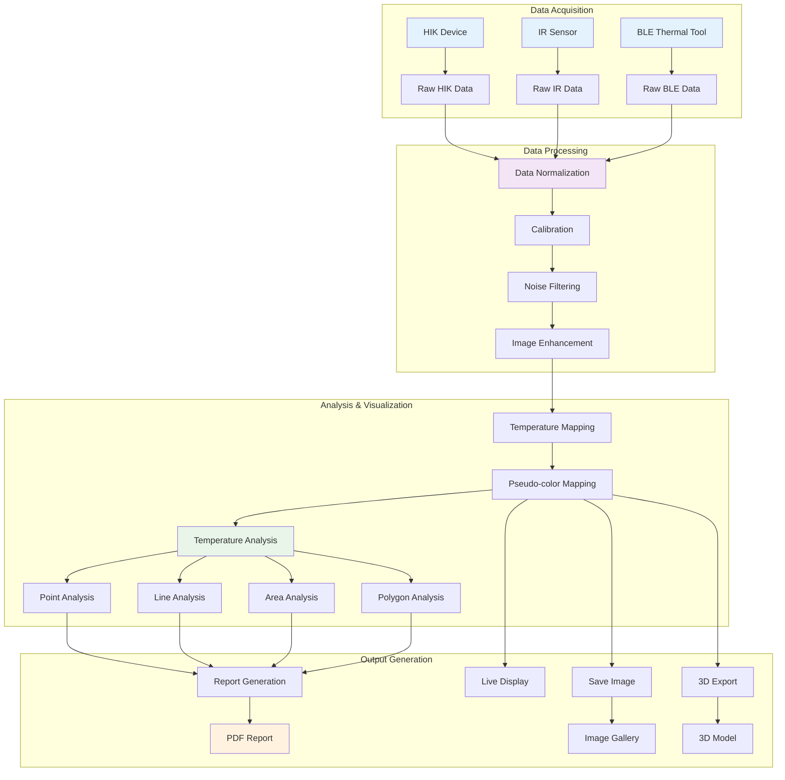

### BLE Device Communication Flow

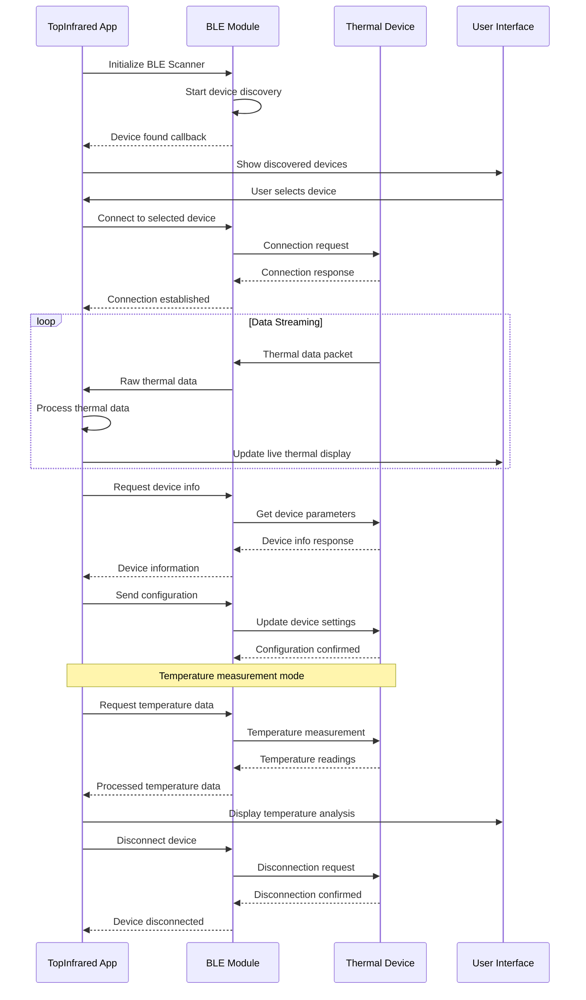

## 🔧 Setup and Installation

### Prerequisites
1. **Android Studio**: Arctic Fox (2020.3.1) or newer
2. **JDK**: Java 8 or Java 11
3. **Android SDK**: API Level 34
4. **NDK**: Version 21.3.6528147 (for native code compilation)
5. **Git**: For version control

### Development Setup

1. **Clone the Repository**
   ```bash
   git clone https://github.com/buccancs/TopInfrared.git
   cd TopInfrared
   ```

2. **Open in Android Studio**
   - Launch Android Studio
   - Select "Open an Existing Project"
   - Navigate to the cloned TopInfrared directory
   - Wait for Gradle sync to complete

3. **Configure Build Environment**
   ```bash
   # Ensure you have the correct NDK version
   # In Android Studio: SDK Manager > SDK Tools > NDK (Side by side)
   # Select version 21.3.6528147
   ```

4. **Build the Project**
   ```bash
   ./gradlew build
   ```

5. **Run on Device/Emulator**
   ```bash
   # For development build
   ./gradlew installDevDebug
   
   # For production build
   ./gradlew installProdRelease
   ```

### Development Setup Flow

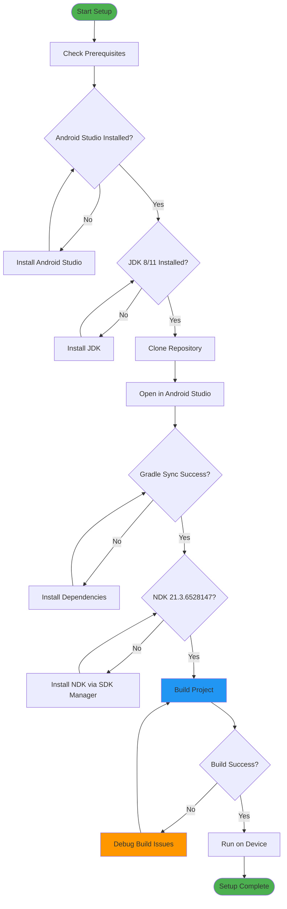

## 📦 Build Variants

TopInfrared supports multiple build variants to target different markets and Android versions:

### Build Variants Architecture

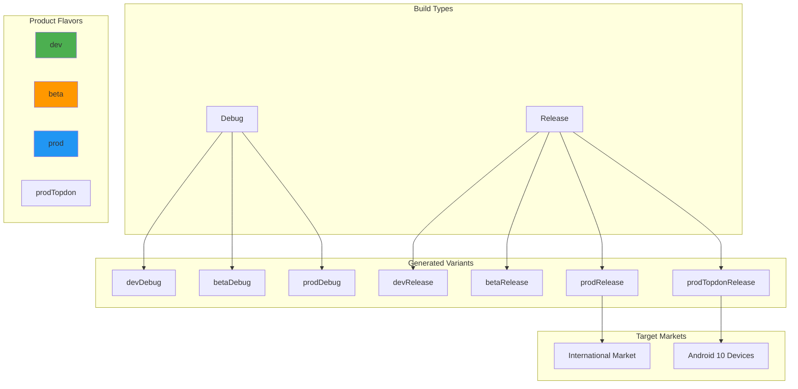

### Deployment Pipeline

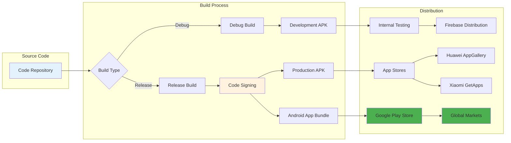

TopInfrared supports multiple build variants to target different markets and Android versions:

### Flavor Dimensions

#### Development Flavors
- **`dev`**: Development build with debug features
- **`beta`**: Beta testing version
- **`prod`**: Production release for international markets
- **`prodTopdon`**: Production build for Android 10 compatibility

### Build Commands

```bash
# Debug builds
./gradlew assembleDevDebug          # Development debug
./gradlew assembleBetaDebug         # Beta debug
./gradlew assembleProdDebug         # Production debug

# Release builds  
./gradlew assembleDevRelease        # Development release
./gradlew assembleBetaRelease       # Beta release
./gradlew assembleProdRelease       # Production release
./gradlew assembleProdTopdonRelease # Android 10 production

# Generate AAB (Android App Bundle)
./gradlew bundleProdRelease
```

## 🛠️ Key Technologies

### Core Framework
- **Android SDK**: Target API 34, Minimum API 24
- **Kotlin**: Primary development language
- **Java**: Legacy code and third-party integrations
- **Gradle**: Build automation and dependency management

### Architecture Components
- **MVVM Pattern**: Model-View-ViewModel architecture
- **Data Binding**: Two-way data binding for UI components
- **Room Database**: Local data persistence
- **RxJava**: Reactive programming for asynchronous operations

### Networking & Communication
- **Retrofit**: HTTP client for API communication
- **OkHttp**: Network layer and connection pooling
- **Bluetooth LE**: Device connectivity and communication
- **Firebase**: Analytics, crash reporting, and messaging

### Image Processing & Graphics
- **OpenCV**: Computer vision and image processing
- **JavaCV**: Java wrapper for OpenCV operations
- **Custom Matrix Operations**: Optimized thermal data processing
- **MPAndroidChart**: Data visualization and charting

### UI/UX Libraries
- **AndroidX**: Modern Android support libraries
- **Material Design**: Google's design system
- **Immersion Bar**: Status bar customization
- **XPopup**: Advanced popup components
- **SmartRefreshLayout**: Pull-to-refresh functionality

### Third-Party Integrations
- **Firebase Suite**: Analytics, Crashlytics, Cloud Messaging
- **WeChat SDK**: Social sharing integration
- **UMeng**: Analytics and A/B testing
- **Zoho SalesIQ**: Customer support integration

## 📁 Module Descriptions

### Core Modules

#### `app/` - Main Application
- Application entry point and main activity
- Global configuration and initialization
- Build variants and signing configurations
- Integration of all feature modules

#### `BleModule/` - Bluetooth Communication
- Bluetooth Low Energy device discovery and pairing
- Device communication protocols
- Connection management and error handling
- Hardware-specific communication adapters

#### `libir/` - Infrared Processing Core
- Core thermal imaging algorithms
- Temperature calibration and conversion
- Infrared sensor data processing
- Hardware abstraction layer

### Feature Modules

#### `component/thermal-*` - Device-Specific Integration
- **`thermal-hik/`**: HIK thermal camera integration
- **`thermal-ir/`**: Generic IR sensor support  
- **`thermal-lite/`**: Lightweight thermal processing
- **`thermal04/`** & **`thermal07/`**: Specific hardware models

#### `component/edit3d/` - 3D Visualization
- 3D thermal data representation
- Interactive 3D thermal models
- Advanced visualization controls

#### `component/pseudo/` - Color Processing
- Pseudo-color palette management
- Thermal-to-visible color mapping
- Custom color scheme creation

#### `component/transfer/` - Data Management
- File transfer utilities
- Data export/import functionality
- Cloud synchronization support

#### `component/user/` - Account Management
- User authentication and registration
- Profile management
- Settings and preferences

### Library Modules

#### `libcom/` - Common Utilities
- PDF report generation
- File system utilities
- Common helper functions
- Shared resources

#### `libui/` - UI Components
- Custom UI widgets
- Charting and graphing components
- Thermal image display components

#### `libhik/` - HIK Integration
- HIK-specific device drivers
- Protocol implementations
- Hardware communication layer

## 🧪 Testing

### Test Structure
```bash
# Unit Tests
./gradlew test

# Instrumented Tests
./gradlew connectedAndroidTest

# Specific module tests
./gradlew :app:test
./gradlew :BleModule:test
```

### Test Coverage
- Unit tests for core thermal processing algorithms
- Integration tests for Bluetooth communication
- UI tests for critical user workflows
- Hardware integration tests (requires physical devices)

## 📱 Deployment

### Release Build Process

1. **Prepare Release**
   ```bash
   # Update version in depend.gradle
   # Ensure all tests pass
   ./gradlew clean
   ```

2. **Generate Signed APK**
   ```bash
   ./gradlew assembleProdRelease
   ```

3. **Generate AAB for Play Store**
   ```bash
   ./gradlew bundleProdRelease
   ```

4. **Automated Build Scripts**
   ```bash
   # Google Play build
   ./build_release_google_apk_script.bat
   
   # TOPDON build
   ./build_release_topdon_apk_script.bat
   ```

### Distribution Channels
- **Google Play Store**: International distribution
- **TOPDON Store**: Regional distribution
- **Enterprise Distribution**: Direct APK distribution for business clients

## 🔒 Security & Privacy

### Data Protection
- Thermal measurement data encrypted at rest
- Secure user authentication
- Privacy-compliant data collection
- GDPR and regional privacy law compliance

### Permissions
- **Bluetooth**: Device connectivity
- **Camera**: Thermal camera access
- **Storage**: Thermal data and report storage
- **Internet**: Cloud features and analytics
- **Location**: Geo-tagging thermal measurements (optional)

## 👤 User Journey & Workflows

### Complete User Journey Map

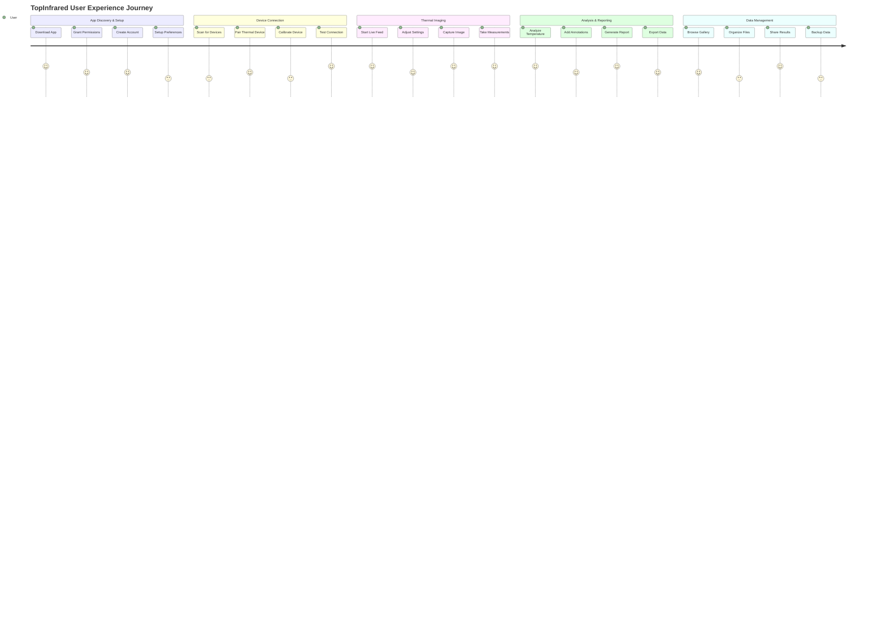

### Thermal Imaging Workflow

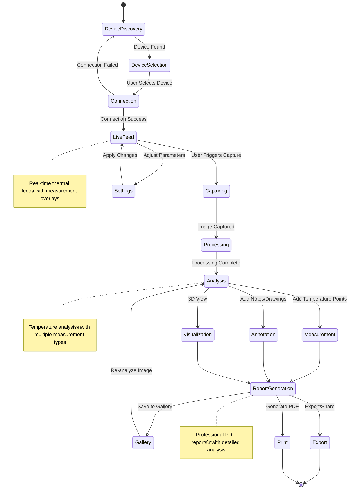

## 🤝 Contributing

### Development Guidelines

1. **Code Style**
   - Follow Android Kotlin style guide
   - Use meaningful variable and function names
   - Maintain consistent indentation (4 spaces)
   - Add documentation for public APIs

2. **Commit Guidelines**
   ```bash
   # Format: type(scope): description
   feat(thermal): add new temperature calibration algorithm
   fix(ble): resolve connection timeout issues
   docs(readme): update installation instructions
   ```

3. **Pull Request Process**
   - Create feature branch from `main`
   - Ensure all tests pass
   - Update documentation if needed
   - Request review from maintainers

4. **Testing Requirements**
   - Add unit tests for new features
   - Verify existing tests still pass
   - Test on multiple Android versions
   - Hardware testing for device-specific features

### Development Environment Setup
```bash
# Install pre-commit hooks
git config core.hooksPath .githooks

# Set up development build
./gradlew assembleDevDebug
./gradlew installDevDebug
```

## 🐛 Troubleshooting

### Common Issues

#### Build Issues
```bash
# Clean and rebuild
./gradlew clean
./gradlew build

# Clear Gradle cache
rm -rf ~/.gradle/caches/
```

#### Bluetooth Connection Issues
- Ensure device permissions are granted
- Check if target hardware is in pairing mode
- Verify Android Bluetooth is enabled
- Try resetting Bluetooth cache in Android settings

#### Thermal Imaging Issues
- Verify camera hardware compatibility
- Check thermal sensor calibration
- Ensure adequate lighting conditions
- Update device firmware if available

### Debugging Tips
- Enable developer options on test device
- Use `adb logcat` for runtime debugging
- Check Firebase Crashlytics for production issues
- Utilize built-in thermal imaging debug mode

## 📞 Support & Contact

### Technical Support
- **Email**: support@topdon.com
- **Phone**: 1-833-629-4832
- **Website**: www.topdon.com
- **Address**: TOPDON USA INC., 400 Commons Way, Suite A, Rockaway, New Jersey 07866

### Development Team
- **Issues**: [GitHub Issues](https://github.com/buccancs/TopInfrared/issues)
- **Discussions**: [GitHub Discussions](https://github.com/buccancs/TopInfrared/discussions)
- **Documentation**: [Wiki](https://github.com/buccancs/TopInfrared/wiki)

### Community
- Professional thermal imaging community support
- Regular updates and feature releases
- Hardware compatibility updates
- User feedback integration

## 📄 License

This project includes various open source components licensed under different terms:

### Apache License 2.0 Components
- RxJava, Room, EventBus, MPAndroidChart
- Glide, Firebase, AndroidUtilCode
- XXPermissions, Gson, OkHttp, Retrofit
- XLog, javacv

### MIT License Components  
- SwipyRefreshLayout

### Proprietary Components
- Core thermal processing algorithms
- Hardware-specific device drivers
- Proprietary image processing enhancements

See `app/src/main/assets/web/third_statement.html` for complete license information.

## 🔄 Version History

### Current Version: v1.10.000 (Build 1100)
- Enhanced thermal image processing algorithms
- Improved Bluetooth connectivity stability
- New 3D thermal visualization features
- Updated UI/UX with Material Design 3
- Performance optimizations for low-end devices
- Extended hardware device compatibility

### Previous Releases
- v1.9.x: Major UI overhaul and cloud integration
- v1.8.x: Advanced thermal analysis tools
- v1.7.x: Multi-language support and localization
- v1.6.x: 3D thermal visualization introduction
- v1.5.x: Enhanced PDF reporting capabilities

---

**TopInfrared** - Empowering professional thermal imaging analysis on Android devices. 

*For the latest updates, visit our [GitHub repository](https://github.com/buccancs/TopInfrared) or contact our support team.*